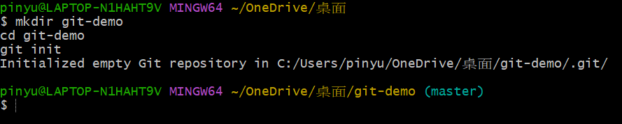
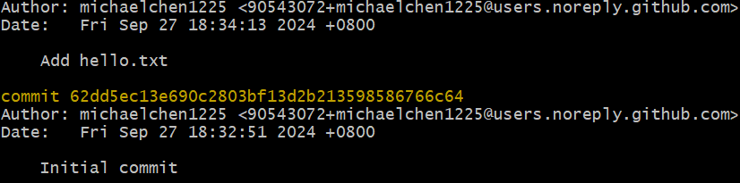
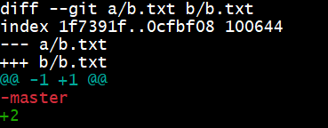

# 基本的 Git 應用 (local repository) 

* [初次設定 Git --- git config](#初次設定-git-----git-config)
* [建立儲存庫 --- git init](#建立儲存庫-----git-init)
* [加入檔案到 index --- git add](#加入檔案到-index-----git-add)
* [查看當前 repo 的狀態 --- git status](#查看當前-repo-的狀態-----git-status)
* [提交變更 --- git commit](#提交變更-----git-commit)
* [查看提交紀錄 --- git log](#查看提交紀錄-----git-log)
* [查看檔案與版本差異 --- git diff](#查看檔案與版本差異-----git-diff)
* [刪除檔案 --- git rm](#刪除檔案-----git-rm)
* [更改檔案名稱 --- git mv](#更改檔案名稱-----git-mv)
* [Commit 時光機 --- git reset](#時光機-----git-reset)
* [只想要救回其中一個檔案 --- git checkout \<branch> \<file](#只想要救回其中一個檔案-----git-checkout-branch-file)


### 初次設定 Git --- git config

設定識別資料：

```bash
git config --global user.name "John Doe"
git config --global user.email johndoe@example.com
```
> 如果只想要在這個專案內用這個識別資料，需要去掉 `--global`。

查看當前的 Git 設定：

```bash
git config --list
```
### 建立儲存庫 --- git init

儲存庫種類：

* local repository (本地儲存庫)
* shared repository (本地共享儲存庫)
* remote repository (遠端儲存庫)

建立 local repository：

> 在儲存庫所在的目錄(資料夾)下執行以下指令：

```bash
git init
```

建立 shared repository：

> 在儲存庫所在的目錄(資料夾)下執行以下指令：

```bash
git init --bare
```

建立 remote repository：

> 例如 GitHub，點「New」


### 加入檔案到 index --- git add

實際建立一個叫做「git-demo」的 local repository：

* Windows 的話，在任意目錄按下右鍵，選擇「Git Bash Here」，然後執行以下指令：

```bash
mkdir git-demo
cd git-demo
git init
```


* 「(master)」表示目前在 master 分支上。現在新增一個檔案：

```bash
echo "# Git-demo" > README.md
```

* 使用 `git status` 查看目前 repo 的狀態：

```bash
git status
```
輸出：
```text
On branch master

No commits yet

Untracked files:
  (use "git add <file>..." to include in what will be committed)
        README.md

nothing added to commit but untracked files present (use "git add" to track)
```

* 輸出表示剛剛加入的 README.md 檔案尚未被 git 追蹤。使用 `git add` 將檔案加入 index：

```bash
git add README.md
```

or

```bash
git add .
```
> 「.」表示該目錄下所有檔案

* 再次查看 git 狀態：

```bash
git status
```
輸出：
```text
On branch master

No commits yet

Changes to be committed:
  (use "git rm --cached <file>..." to unstage)
        new file:   README.md
```
> 表示現在 README.md 檔案已經存在於 index 中，也就是開始被 git 追蹤，並且可以準備 commit 了。

(關於 index 的介紹，可以參考[這裡](https://github.com/michaelchen1225/Git-note/blob/master/02/02.md))

### 查看當前 repo 的狀態 --- git status

```bash
git status
```

精簡版：
    
```bash
git status -s
```

### 提交變更 --- git commit

```bash
git commit -m "Initial commit"
```
> 「-m」後面的「Initial commit」是這次 commit 的訊息，可以自己定義。

再建立一個新檔案，然後再次提交變更：

```bash
echo "Hello, Git!" > hello.txt
git add .
git commit -m "Add hello.txt"
```

### 查看提交紀錄 --- git log

上面總共提交了兩次變更，可以使用 `git log` 查看提交紀錄：

```bash
git log
```
輸出：

> HEAD 表示目前所在的 commit。

* 指定輸出最近的幾筆紀錄：

```bash
git log -1
```

### 查看檔案與版本差異 --- git diff

* 在還沒 add 之前，查看自己做了那些變更：

```bash
git diff
```

* add 之後，查看 index 與 HEAD 的差異：

```bash
git diff --cached
```

* 查看兩個 branch 之間的最新 commit 的差異：

```bash
git diff <branch-1> <branch-2>
```
> 關於 branch 的介紹，可以參考[這裡](https://github.com/michaelchen1225/Git-note/blob/master/03/03.md)

* 查看兩個 commit 之間的差異：

```bash
git diff <commit-id-1> <commit-id-2>
```

**diff 的輸出解讀**：

以這張圖片為例：



* `diff --git a/b.txt b/b.txt`：表示這次 diff 是針對 b.txt 檔案。
* `--- a/b.txt`：表示這是舊的 b.txt 檔案。
* `+++ b/b.txt`：表示這是新的 b.txt 檔案。
* `@@ -1 +1 @@`：表示這次 diff 表示舊檔案只有一行，新檔案也只有一行。(如果新檔案有三行，就會是 @@ -1 +1,2 @@)
* 邊更內容：
  * `- 號開頭`：表示新檔案刪除了這一行。
  * `+ 號開頭`：表示新檔案新增了這一行。

### 刪除檔案 --- git rm

刪掉 hello.txt 檔案：

```bash
git rm hello.txt
```
> 除了取消 git 追蹤 hello.txt 檔案，同時也會刪除實體檔案。

查看 status，這個刪除的動作會直接加入 index(不用重新 add)：

```bash
git status
```
輸出：
```text
On branch master
Changes to be committed:
  (use "git restore --staged <file>..." to unstage)
        deleted:    hello.txt

```

提交這次的變更：

```bash
git commit -m "Delete hello.txt"
```

---

**補充**

如果只是想刪除 index 裡的檔案(透過 `git add` 加入 index)，但不想刪除實體檔案，可以使用 `git rm --cached`：

```bash
git rm --cached hello.txt
```
> 這樣只會將 hello.txt 從 index 中刪除，實體檔案不會被刪除。

***


### 更改檔案名稱 --- git mv

更改 README.md 檔案名稱為 git-demo.md：

```bash
git mv README.md git-demo.md
```

同樣看一下 status：

```bash
git status
```
輸出：
```text
On branch master
Changes to be committed:
  (use "git restore --staged <file>..." to unstage)
        renamed:    README.md -> git-demo.md
```

同樣直接提交變更，不用重新 add：

```bash
git commit -m "Rename README.md to git-demo.md"
```

### 時光機 --- git reset


語法：

```bash
git reset --<mode> <commit-id>
```
* 表示將 HEAD 移動到之前某個 commit 的狀態。

* commit-id 可以從 git log 中找到。

* 除了用 commit-id 之外，也可以用 HEAD 的相對位置表示：
  * HEAD^：回到上一個 commit，有 n 個「^」就是回到前 n 個 commit。例如 HEAD^^ 表示回到上上個 commit。
  * HEAD\~n：回到前 n 個 commit。例如 HEAD~3 表示回到前三個 commit。


* mode 有三種模式可選：

  > 以下假設 reset 回之前的 commit A

  * **soft**：工作目錄保持現狀，只重設 HEAD。倒回去後如果發現 A 的狀態與當前工作目錄不一樣，會將差異直接紀錄在 index。

  * **mixed**：工作目錄保持現狀，但會清空 index。重設 HEAD 之後，如過發現 A 的狀態與工作目錄現狀不同，會認為我們做了「某些改變」，導致 A 狀態變成現在的工作目錄，需要我們自己將改變 add 到 index。

  * **hard**：重設 HEAD，並且將 index 與工作目錄的狀態完全還原到 A 的狀態。

  > 新增的檔案如果還沒 add，因為 git 還沒開始追蹤所以不會 reset 指令的影響。但如果 add 卻沒 commit，使用 hard 就會被永遠刪除

git reset 常見應用：

* 將所有檔案的改動都取消，回到當前 HEAD 的狀態：
```bash
git reset --hard 
```

* 發現這次 commit 的訊息打錯了，但想保留變更，可以使用 soft 回到上一個 commit：

```bash
git reset --soft HEAD^
```

* 已經 add 但還沒 commit，想取消這次 add(就是清空 index)：

```bash
git reset
```

* 使用 hard 卻後悔了，可以先用 git reflog 查看歷史操作，然後再用 git reset 回到使用 hard 之前的狀態：

```bash
git reflog
git reset --hard HEAD@{1}
```
> reflog 之後的章節會再詳細介紹。

### 只想要救回其中一個檔案 --- git checkout \<commit-hash> \<file>

假如有一堆檔案都被改動且加入了 index 但尚未 commit，想要撤銷其中一個檔案的改動，可以使用 `git checkout`：

```bash
git checkout master hello.txt
```
> 這會使用 master branch 最新 commit 中的 hello.txt 檔案覆蓋當前工作目錄中的 hello.txt 檔案。


但如果改動已經提交了，想要復原上一個 commit 中的某一個檔案，可以：

```bash
git checkout HEAD^ hello.txt
```
> 就會將上一個 commit 中的 hello.txt 檔案加入到當前工作目錄，會視為一次變更(新增 hello.txt)。

