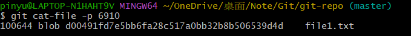

# Git 的資料結構：Object & Index


* [Git 的資料結構](#git-的資料結構)

  * [Index](#index)

  * [Object](#object)

    * [Object 的種類 --- blob, tree, commit, tag](#object-的種類-----blob-tree-commit-tag)

    * [不同 Object 之間的關係](#object-之間的關係)

    * [用實際範例說清楚 Object](#用實際範例說清楚-object)
    
    * [總結：Object 的特性](#總結object-的特性)

## Git 的資料結構

在工作目錄下執行「git init」後，會在目錄下建立一個名為「.git」的目錄，用來儲存關於 Git 版本控制的相關資訊。


而 Git 比較重要的資料結構分為以下兩種：

* **Index**：紀錄準備要 commit 的檔案。

* **Object**：版本控制的核心在於「紀錄變化」，Object 就是用來紀錄版本控制中的各種內容，例如檔案內容、目錄內容、commit 等等。

Index 與 Object 之間的關係如下：

> 我們將工作目錄裡的變化更新到 Index，最終形成用來做版本控制的 Object。凡走過必留下痕跡，透過「更新 index、產生 Object」的過程，每次的 commit 都會有相對應的 Object 來記錄。


## Index

Index 是一個檔案，通常位於「.git」目錄下，檔名為「index」。

Index 用來記錄「準備能提交的檔案」，如果用 `git status` 去看，那些被歸類為「Changes to be committed」的檔案，就是 Index 裡的內容。

關於 Index 的常用指令可以看上一篇，這裡做一些簡介：

* `git add`：將檔案加入 Index。

* `git rm`：將檔案從 Index 移除、並刪除實體檔案。

* `git mv`：將檔案從 Index 更名、也會改變實體檔名。

* `git status`：查看目前 git repo 的整體情況。

* `git ls-files`：僅列出 Index 裡的檔案。(目前可被 commit 的檔案)

## Object

Object 的產生過程如下：

* 情境：「資料 A」要被做成 Object

1. 將「資料 A」 hash，得到 hash 值 = adcd....

2. 將「資料 A」的內容用 **zlib** 壓縮，形成 Object，然後把這個 Object 放進一個叫做「ab」的目錄，並把 Object 取名為「cd....」。

> 步驟一得到的 hash 值，前兩個字母會用來命名目錄，剩下的字母則用來命名 Object

### Object 的種類 --- blob, tree, commit, tag

那麼，上面情境中的「資料 A」會是什麼呢？大概能猜到是 Git 版本控制的相關內容。

而不同的內容，會形成的不同種類 Object，常見的 Object 有以下四種：

* **blob**：儲存檔案內容。注意，就只有檔案內容而已，其他什麼檔名、時間、等等都不包含在內。

* **tree**：儲存目錄底下的內容，例如子目錄、檔名等等。可以理解成「特定版本下，某目錄的快照」。目錄長這樣：

  ```text
  git-repo
  |
  ├── dir1
  │   ├── file2
  |
  |── file1
  ```

  git-repo 被做成 tree object 後，tree object 裡會含有三種資訊：

    1. dir1 的 tree object

    2. file1's blob object 的檔名

    3. file1 原本的檔名。


* **commit**：儲存 commit 的相關資訊，例如 commit 的作者、時間、commit 訊息、上一次 commit 的 hash 值等等。

* **tag**：用來標記特定的 commit 版本。(因為 commit 版本有很多，但全都是 hash 值不好辨認，所以用一個人類比較好懂得 tag 來標記)

> 在以上四種都是 Object，除了 tag 不會被 hash 與壓縮外，其他三種都會經過「內容被 hash --> 壓縮成 zlib 格式 --> 用 hash 值命名目錄、檔名」的過程。

### 不同 Object 之間的關係

以上四種 Object 的關係是層層相扣的，單獨一個 Object 實際上並沒有太大意義，舉例來說：

* 單純的 blob object，只能說明有這個「內容」存在，但這個內容叫什麼檔名、在哪個目錄下，我們得看 tree object。

* 只有 tree Object 也不夠，因為我們只能知道某個目錄底下有哪些檔案、子目錄，但卻不知道這些檔案的內容。

* 就算具備了 blob 與 tree object，雖然能了解一個目錄的具體情況與檔案內容，但是我們卻不清楚該目錄是屬於哪個 commit 版本，無法做到版本控制。


下圖說明了這四種 Object 之間的關係：


### 用實際範例說清楚 Object

> 你也可以先看原作者的影片，同樣也是實際範例：[認識 Git 資料結構中的物件資料庫與物件之間的關係](https://www.youtube.com/watch?v=PZbSRy_ow0U)

建立一個新專案：

```
mkdir git-repo
```

進入專案目錄，並初始化形成 git repo：

```
cd git-repo
git init
  ```

可以發現馬上多了一個「.git」目錄：

```
ls -a
```


新增一個檔案：

```
echo 1 > file1.txt
```

將檔案加入 Index：

```
git add .
```

可以發現此時 .git/objects 底下多出了一個「d0」目錄，裡面有一個「0491fd...」的檔案：

```
ls .git/objects
ls .git/objects/d0
```


這個 d0 目錄裡面的就是由 file1.txt 產生的 blob object，可以這樣查看 file1.txt 產生的 hash 值：

```
git hash-object file1.txt
```


> 正如前面所說，hash 值的前兩個字母會用來命名目錄，剩下的字母則用來命名 Object。

接著，我們可以提交 file1.txt，形成第一個 commit 版本：

```
git commit -m "add file1.txt"
```

查看一下該 commit 版本的 hash 值：

```
git log
```


該 commit 的 hash 為 135d95....，正好對應到 .git/objects 目錄下的一個 commit object：

```
ls .git/objects/13
```


然後我們來看看該 commit object 中記載的內容：

```
git cat-file -p 135d
```


這樣就能看到這次藉由 commit object 看到這次版本的資訊(誰、什麼時候、commit 訊息等等)。

值得注意的是，commit object 中記載了一個 tree object 的 hash 值：「69100....｣，正好對應到 .git/objects 目錄下的一個 tree object：

```
ls .git/objects/69
```


來看看這個 tree object 的內容：

```
git cat-file -p 6910
```


透過這個 tree object，我們可以看到這次 commit 版本下的「目錄快照」，這個目錄有一個名為 file1.txt 的檔案，該檔案的內容則指向另一個 hash 值，這個 hash 值就是 file1.txt 的 blob object：

```
git cat-file -p d004
```

> 這個指令能夠看到解壓縮後的檔案內容。如果你直接用 cat 去看會是亂碼。


然後我們嘗試幫這個 commit 貼上一個 tag：

```
git tag v1 135d
```

這個 tag 物件會位於 .git/refs/tags 目錄下，我們直接來看 tag 物件的內容：

```
cat .git/refs/tags/v1
```

> 內容很單純，就是指向該 commit 版本的 hash 值。

此時如果想要看第一次 commit object 的內容，就可以直接用 tag 來觀察：

```
git cat-file -p v1
```


---

在上面的例子中，可以觀察到透過層層遞進的方式，我們能一步步的了解到某個 commit 版本的內容，這也是 Git 版本控制的核心概念。

接下來我們在 git-repo 中，再新增一個目錄 dir1，並在 dir1 中新增一個檔案 file2：

```
mkdir dir1
echo 1 > dir1/file2.txt
```

在更新 index 之前，我們先看看 .git/objects 目前有哪些 Object：

```
ls .git/objects
```


> 13：剛才的 commit object、69：剛才的 tree object、d0：剛才的 blob object。


將變化加入 Index：

```
git add .
```

按照第一次 add 的經驗，.git/objects 此時應該會多出另一個 blob object：

```
ls .git/objects
```

> 會發現啥都沒變，這是因為 file2.txt 的內容與 file1.txt 同樣都是「1」，所以 Git 不會重複產生 blob object。

提交這次變更：

```
git commit -m "add dir1/file2.txt"
```

查看第二次 commit 版本的 hash 值：

```
git log
```


查看第二次 commit 版本的 tree object：

```
git cat-file -p 14e9
```


可以看到 dir1 的 tree object 為 7a25...，並且有標記上一次 commit 版本的 hash 值(parent)。

觀察新的 tree object：

```
git cat-file -p 7a25
```


新的 tree object 就是「新的目錄快照」，可以這樣解讀：

* 新版本中，git-repo 裡多出了一個子目錄 dir1，所以除了本來就存在的 file1.txt 之外，新的 tree object 裡有包含一個指向 dir1 的 tree object (323a...)。


查看 dir1 的 tree object：

```
git cat-file -p 323a
```

> file2.txt 被記錄在這裡！且因為 file2.txt 的內容與 file1.txt 相同，所以會沿用 file1.txt 的 blob object。


### 總結：Object 的特性

「Object」是一種「不可變的」 (immutable) 檔案類型，所有儲存在「物件儲存區」的檔案通常只進不出，也不會被修改內容。

原因在於，如果你竄改了檔案內容，新的內容所運算出來的 hash 值將會與原有物件的檔名不一樣，這導致 Git 無法繼續執行，相對地也對 Git 儲存庫產生了一定程度的保護作用。

這樣的設計，帶來了以下優點：

* 有效率的處理大型專案
  
  由於所有的 blob object 都是透過「內容」來做定址的 (content addressable)，因此，若在不同版本之間找尋相同的內容，效率是非常高的。

* 歷史紀錄保護

  Git 版控的過程，每次提交變更都會產生一個 commit、tree、blob object 是彼此層層關聯下去的，若想竄改某個版本的歷史紀錄，困難度也是挺高的！

* 定期的封裝物件

  每次更新時，只要檔案內容不一樣，就會建立一個新的 "object"，這些不同內容的檔案全部都會保留下來。

  當一個專案越來越大、版本越來越多時，object 就會越來越多，雖然每個檔案都已經各自壓縮了，不過過多的檔案還是會讓存取效率下降。
  
  因此 Git 的設計有個機制可以將一群老舊的 "物件" 自動封裝進一個封裝檔(packfile)中，以改善檔案存取效率。(封裝檔存在於 .git/objects/pack 目錄下)


