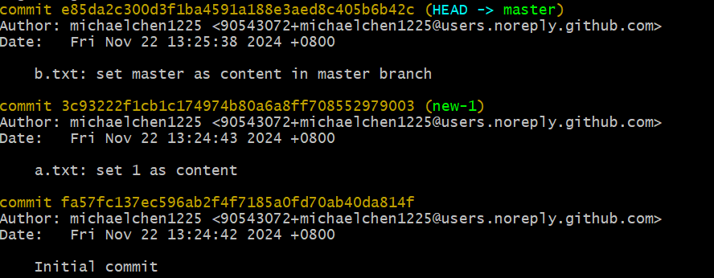

# Branch 的基本應用

## 目錄

* [什麼是 Branch](#什麼是-branch)

  * [建立 Branch 的底層含意：讓一個「有意義的名字」指向某個 commit](#建立-branch-的底層含意讓一個有意義的名字指向某個-commit)

* [實作](#實作)

  * [環境準備](#環境準備)

  * [實作：建立、切換 branch](#實作建立切換-branch)

  * [實作：刪除 branch，然後重新把這個 branch 救回來 (解決斷頭問題)](#實作刪除-branch然後重新把這個-branch-救回來-解決斷頭問題)

  * [補充：在過去的 commit 上建立 branch](#補充在過去的-commit-上建立-branch)

  * [實作：將 git repo 匯入 SourceTree](#實作將-git-repo-匯入-sourcetree)

  * [斷頭（detached HEAD）是怎麼一回事？](#斷頭detached-head是怎麼一回事)

* [Branch 的基本指令彙整](#branch-的基本指令彙整)

## 什麼是 Branch

如果所有人都在 master branch 做修改，可能會發生 B 覆蓋 A 的情況，雖然可以用 reset 等等往回復原，但是這樣很麻煩，且沒效率。因此，使用 branch 來分開不同的修改，之侯整合時再進行 merge，有衝突的話也能及時處理。

Git 屬於「**分散式**版本控管機制」，最不想做的事情就是「管理」，所以 Git 很少有管理權限的機制，它唯一想做的僅僅是讓大家可以順利的「分支」與「合併」而已。

當我們在一個狀態下開啟新的分支時，效果有點像是打遊戲時，同一個遊戲場景開了兩條支線，一個繼續做主線，另一個是為了做支線任務。因為支線是從原本的主線分出來的，所以最初的遊戲環境也會一樣，回到 git 上道理也相同，**新的 branch 會繼承 parent anch 的所有歷史紀錄**。 

### 建立 Branch 的底層含意：讓一個「有意義的名字」指向某個 commit

在使用 git 時我們會建立 commit 來記錄每次的變動，相當於幫工作目錄的狀態建立一個「遊戲存檔點」。

如果這時我們在原本的 brach 上，心想：「想開條支線來玩一下」，我們就會建立一個新的 branch 來做「支線任務」。

前面提過，branch 會繼承 parent branch 的所有歷史紀錄，相當於將同一個環境複製一份出來，而這個複製的依據就是「**parent branch 的某個 commit**」。

簡單來說，建立 branch 的底層含意就是：**讓一個「有意義的名字」指向某個 commit**。

## 實作

### 環境準備

* 創建一個 git-branch-demo 資料夾，並初始化 git。

```bash
mkdir git-branch-demo
cd git-branch-demo
git init
```

* 新增 a.txt，並做「Initial commit」。

```bash
echo . > a.txt
git add .
git commit -m "Initial commit"
```

* 更改 a.txt 內容為 1，並 commit 這次變更：a.txt: set 1 as content

```bash
echo 1 > a.txt
git add .
git commit -m "a.txt: set 1 as content"
```

### 實作：建立、切換 branch

* 查看現在有多少 branch：

```bash
git branch
```
```text
* master
```

> 現在只有 master 這個 branch。我們所在的 branch 前面會有一個星號(*)。

* 嘗試刪除 master branch：

```bash
git branch -d master
```
```text
error: Cannot delete the branch 'master' which you are currently on.
```

> 無法刪除目前所在的 branch，必須切換到其他 branch 才能刪除。

* 建立一個新的 branch，但將工作目錄維持在目前的 master branch：

```bash
git branch new-1
```

* 現在我們有兩個 branch：

```bash
git branch
```
```text
* master
  new-1
```

* 此時，我們再 master branch 再新增一個檔案並 commit：

```bash
echo master > b.txt
git add .
git commit -m "b.txt: set master as content in master branch" 
```

> 統整一下目前的情況：先在 master 上做了兩次 commit (Initial & set 1 as a.txt content)，然後建立了一個新的 branch new-1，最後又在 master 上做了一次 commit (set master as b.txt content)。


* 再建立一個新的 branch，並切換到這個新的 branch：

```bash
git checkout -b new-2
```

* 這時我們將 b.txt 的內容改為 new-2，並 commit：

```bash
echo new-2 > b.txt
git add .
git commit -m "b.txt: set new-2 as content in new-2 branch"
```

* 這時我們在 new-2 branch 上查看 log，會發現有四條 log，其中三條是 master branch，一條是 new-2 branch，這是因為 new-2 是從 master 分出來的，所以 new-2 會繼承 master 的歷史紀錄。 

```bash
git log
```


* 不過我們現在切回到 master branch，再查看 log，會發現只有三條 log，就像打遊戲時，支線的任務進度不會影響主線的進度一樣：

```bash
git checkout master
git log
```



* 切到 new-1 branch 並查看 log，會發現只有兩條，因為 new-1 是在 master 的第二次 commit 之後建立的：

```bash
git checkout new-1
git log
```


### 實作：刪除 branch，然後重新把這個 branch 救回來 (解決斷頭問題)

* 現在回到 master branch，我們可以刪除 new-1 branch：

```bash
git checkout master
git branch -d new-1
```

* 因為我們剛才是在 master 的第二個 commit 後建立 new-1，所以現在我們先將工作目錄的狀態「切換」到 master 的第二個 commit (3c93)：

```bash
git checkout 3c93
```


* 這時候出現了「detached HEAD」的狀態，這裡先[插播一下](#斷頭detached-head是怎麼一回事)，來搞清楚為何出現這個狀態。

* 了解斷頭的概念後，我們給這個 commit 一個 branch 名稱：

```bash
git checkout -b new-1
```

* 然後再建立一個新檔案並 commit：

```bash
echo new-1 > b.txt
git add .
git commit -m "b.txt: set new-1 as content in new-1 branch"
```

### 補充：在過去的 commit 上建立 branch

* 如果我們想在過去的 commit 上建立 branch，可以透過 commit 的 hash 值來做：

```bash
git checkout -b new-3 3c93
```

or

```bash
git branch new-3 3c93
```

### 實作：將 git repo 匯入 SourceTree

上面我們建立了許多分支，雖然在腦中可以模擬出來，但當分支多起來後就很難想像了，這實我們能透過 SourceTree 來看到整個 git repo 的結構：

* 開啟 SourceTree，加入 git repo 後會長這樣：


* 可以看到，我們有三個 branch，分別是 master、new-1、new-2，名稱所在的地方就是該 branch 的最新 commit。
  * 最上面的 commit 就是最新的 commit，我們最新的 commit 位於 new-1 branch，所以圖中最上面的就是 new-1 branch。
  * 最左邊藍色的線是以目前最新版的 commit 為基準，哪條 branch 擁有最新的 commit，就會出現在最左邊藍色的線上。 
  * 從分岔點可以看出某條 branch 是從哪個 commit 分出來的。

### 實作：將別的 branch 的檔案複製到目前的 branch

* 如果我們想將 new-1 branch 的 b.txt 複製到 master branch，可以透過以下指令：

```bash
git checkout master
git checkout new-1 b.txt 
```
> checkout 造成的任何更動都會被加入到 index 中。(這個 checkout 的用法在第一章有提到，不過當時是拿來復原檔案的)

* 察看一下 index 與上一次 commit 的差異：

```bash
git diff --cached
```


> 沒錯！ b.txt 的內容已經從 master 變成 new-1 了。

* 捨棄掉這次的變更：

```bash
git reset --hard
```

### 斷頭（detached HEAD）是怎麼一回事？

首先得先了解「HEAD」是什麼：

* HEAD 是一個指標，指向某個 branch 或 commit，效果是「設定當前工作目錄的狀態」。

正常情況下，brach 的名稱會指向當前該 branch 上最新的 commit，通常 HEAD 會同時指向這個 branch 與最新的 commit，例如：


換句話說，當一個 commit 有被一個 branch 指著時，代表的是該 branch 的最新狀態，而最新狀態通常由 HEAD 指著，因此該 commit 就是「有頭的」。

反過來說，當一個 commit 沒有被任何 branch 指向時，代表它屬於頭(HEAD)之下的「身體部分」，也就是某條 branch 的「歷史」，這樣的 commit 就是「無頭的」(只有身體當然就是無頭)。

總而言之，有沒有頭的差別並非是該 commit 是否被 HEAD 指著，而是「該 commit 是否被 **branch 指著**」：

> 頭 = branch's name + commit = 最新狀態

> 無頭 = 身體 = commit =歷史紀錄


這時如果我們用「git checkout」將 HEAD 指向「無頭 commit」時，就會出現「detached HEAD」的狀態，意義是「**目前的工作目錄並不處於最新狀態**」，畢竟現在的 HEAD 指向的僅是一個 brach 的歷史紀錄罷了。

如果我們硬要在「歷史紀錄上」做 commit，由於無頭的緣故，雖然新的 commit 能被做出來，但它仍然是無頭的，這種「從身體長出來的無頭 commit」，最終會被 Git 的垃圾回收機制清除掉。

那如果我們想保留這個無頭 commit，該怎麼辦呢？很簡單，就給他一個頭就好了，也就是在該 commit 上建立一個 branch 來指向它，這樣這個 commit 就有了頭，也就不會被清除掉。

## Branch 的基本指令彙整

* 建立 branch：

```bash
git branch <branch-name>
```

* 建立 branch 並切換過去：

```bash
git checkout -b <branch-name>
```

* 在過去的 commit 上建立 branch：

```bash
git checkout -b <branch-name> <commit-hash>
```

or

```bash
git branch <branch-name> <commit-hash>
```


* 切換 branch：

```bash
git checkout <branch-name>
```

* 刪除 branch：

```bash
git branch -d <branch-name>
```

* 查看 branch：

```bash
git branch
```

* 從別的 branch 複製檔案到目前的 branch：

```bash
git checkout <branch-name> <file>
```

