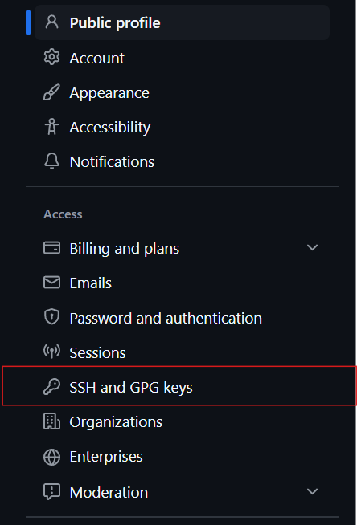

# 初次使用 Github  

> 來設想一個環境：我開發了一份程式碼，想要**紀錄開發歷程**，也想要找其他人來**協作開發**。這時候，我需要一個工具來幫助我管理程式碼的版本，並且能夠與其他人分享我的程式碼。這時，底下要介紹的 **Git** 和 **GitHub** 就登場了。

## 目錄

* [Git 是什麼？](#git-是什麼？)
* [GitHub 是什麼？](#github-是什麼？)
* [我能用 GitHub 做什麼？](#我能用-github-做什麼？)
* [建立第一個 GitHub 專案](#建立第一個-github-專案)
  * [Step 1: 下載 Git](#step-1-下載-git)
  * [Step 2：初次設定 Git](#step-2初次設定-git)
  * [Step 3：建立一個新的儲存庫](#step-3建立一個新的儲存庫)
  * [Step 4：設定 SSH 金鑰](#step-4設定-ssh-金鑰)
  * [Step 5：在本地新增一個專案，並與 GitHub 連結](#step-5在本地新增一個專案並與-github-連結)
  * [Step 6：檢查 GitHub 上的儲存庫](#step-6檢查-github-上的儲存庫)
* [後續操作](#後續操作)
  * [1. 提交修改](#1-提交修改)
  * [2. 時光機：回到上一次的版本](#2-時光機回到上一次的版本)
  * [3. 在別台電腦上下載專案](#3-在別台電腦上下載專案)
* [小結](#小結)

## Git 是什麼？

[**Git**](https://git-scm.com/) 是一個 **分散式版本控制系統（Distributed Version Control System, DVCS）**。它由 **Linus Torvalds**（Linux 之父）開發，原本是為了管理 Linux 核心的原始碼。

### Git 的核心功能：

* **版本控制**：追蹤檔案的「變更歷史」，還能夠還原到過去的版本。(類似遊戲的存檔功能)

* **分支與合併（Branch & Merge）**：如果用遊戲來打比方，分支就好像是「主線」與「支線」，「主分支」為標準進度，而「其他分支」則用來開發新功能、做測試，等最後再合併回主分支。「分支」的功能相當適合團隊協作。

* **離線操作**：因為是「分散式」，大多數操作（如提交 commit、查看歷史）都可以在本機進行，不需連網。

* **高效 & 安全**：Git 對版本記錄的處理方式快速且難以被篡改。

> 分支概念圖：


---

## GitHub 是什麼？

[**GitHub**](https://github.com) 是一個基於 Git 的 **遠端代碼託管平台**，提供了圖形化介面與多人協作功能，是目前世界上最大規模的程式碼託管平台之一。

我們在瀏覽器上打開 Github 的網站、建好儲存庫(repository)之後，就能快速的把檔案（不僅限於程式碼）用 Git 儲存到 Github 上 ; 反之，也能用 Git 從 GitHub 上下載檔案到本地：


無論是私人專案、公開專案或開源專案，都可以在 GitHub 上進行管理與分享。如今，Github 上已經有成千上萬的開源專案，從手機 APP、軟體、電子書、甚至食譜都能在 GitHub 上找到。

> 簡單說：**Git 是工具，GitHub 是服務**。

### GitHub 的特色功能：

* **儲存庫（Repository）**：儲存庫的名稱即「專案名稱」，可以看做一個「資料夾」，用來存放程式碼、文件等。

* **Pull Request（PR）**：用於協作開發，開發者提交 **PR** 將修改建議提交給專案擁有者，擁有者審核後可進行合併、討論。

* **Explore**：可以瀏覽、搜尋其他公開專案，尋找靈感、學習資源、協作機會等。

> 線上的代碼託管平台還有很多，像是 GitLab、Bitbucket 等，但 GitHub 是目前最受歡迎、資源最豐富的平台。

## 我能用 GitHub 做什麼？

主要看你的需求：

* **專案備份**：當你有份專案在 Github 上，通常你本地也會有一個副本，這樣就能確保專案不會因為本地電腦故障而丟失。

* **個人作品集**：這在求職時特別有用，除了展現專案中所使用的技術能力，還順帶展現出你會 Git 與具備協作能力，因為你用 Github 嘛。

* **多人協作**：讓合作不再限於同台電腦、地區，透過 GitHub 上創建一個共享儲存庫，讓團隊成員可以隨時進行協作。

* **創意分享**：當你有個不錯的想法，但又不想自己一個人開發，可以將專案放到 GitHub 上，如果有人對你的專案感興趣可以一起開發。

* **學習資源**：GitHub 上能學得不只是程式碼、舉凡哲學、藝術、心理學、歷史、食譜、他人的閱讀筆記等等，都能在 GitHub 上找到文件/PDF等資源。

* **開源軟體**：GitHub 上有很多開源軟體可以下載，例如音樂播放器、編輯器、遊戲等等，這些軟體通常是免費的，並且可以自由修改。

OK，以下我們就從下載 Git 開始，一步步地把一個新專案丟到 Github，並體驗一下版本控制的操作。

## 建立第一個 GitHub 專案

### Step 1: 下載 Git

首先，你的電腦上必須要先有 Git。可以到 [Git 官網](https://git-scm.com/downloads) 下載適合你作業系統的版本。


> 如果選擇 windows 的話(https://git-scm.com/downloads/win)，一般都是選擇「Git for Windows/x64 Setup.」

### Step 2：初次設定 Git

安裝完成後，打開終端機來設定基礎的使用者資訊：

> 以 Windows 為例，在搜尋欄中輸入「Git Bash」或「cmd」都可以取得一個終端機視窗。

```bash
git config --global user.name "Your Name"
git config --global user.email your-eamil@example.com
```

設定完後，確認一下設定是否成功：

```bash
git config --global --list
```
> 檢查是輸出中的 `user.name` 和 `user.email` 是否正確。

### Step 3：建立一個新的儲存庫

接著來到 [GitHub](https://github.com)，登入你的帳號（如果還沒有帳號，先註冊一個）。

登入後在畫面的右上方可以看到帳號頭像，點擊頭像左邊的「+」按鈕，選擇「New repository」來建立一個新的儲存庫：


接著會來到建立儲存庫的頁面，這裡我們填入：

* **Repository name**：命名儲存庫，例如 `my-first-repo`。
* **Description**：簡短描述這個儲存庫的內容，讓其他人能快速了解。


> 預設上，這個儲存庫是 **Public** 的，表示任何人都可以看到、下載這個儲存庫的內容。如果你想要讓它成為私人儲存庫，可以選擇 **Private**。

填完名稱和描述後，其他都可以先維持預設，然後點擊最下方「Create repository」的綠色按鈕，這樣我們就建立了一個新的儲存庫：


### Step 4：設定 SSH 金鑰

在未來的操作中，如果我們想要把更新推送到 GitHub 上都會需要做身分驗證，最常用的方式是透過 **SSH 金鑰**：

* SSH key 會有**公鑰**和**私鑰**，兩者能互相驗證。我們將公鑰上傳到 GitHub，私鑰則保存在本地電腦。

  * 這樣一來，推送更新時 GitHub 就會用公鑰來驗證你電腦上的私鑰，確保你有權限進行操作。

  * 反過來說，若你的私鑰被盜取，其他人就能冒充你進行操作，所以私鑰一定不要隨意分享、上傳到網路上。

以下為設定 SSH 金鑰的步驟：

* 打開終端機，產生 ssh key：

  ```bash
   ssh-keygen -t rsa -C "yourEmail@example.com"
  ```
  > 這會在家目錄下的 `.ssh` 目錄中產生一對 SSH 金鑰，通常公鑰是 `id_rsa.pub`，私鑰是 `id_rsa`。

* 輸出 `~/.ssh/id_rsa.pubid_rsa.pub` (公鑰)的內容，並將輸出的內容複製起來：

  ```bash
  cat ~/.ssh/id_rsa.pub
  ```
  > 從「ssh-rsa」開始到「你的 email」結尾的整段文字都是公鑰。

* 接著登入 [GitHub](https://github.com)，點開右上角的頭像，找到「Settings」：

  

* 進入「Settings」後，點開左側選單中的「SSH and GPG keys」：

  

* 點開綠色的「**New SSH key**」按鈕，在「Title」欄位填入一個描述（例如：`My Laptop`），並將剛才複製的 `id_rsa.pub` 的內容貼到「Key」欄位中，最後點擊「**Add SSH key**」：

  


* 這樣我們就成功將公鑰添加到 GitHub 上了。我們回到終端機，來測試一下 SSH 金鑰是否設定成功：

  ```bash
  ssh -T git@github.com
  ```

* 如果一切順利，你應該會看到類似下面的訊息：
  ```text
  Hi yourUsername! You've successfully authenticated, but GitHub does not provide shell access.
  ```

### Step 5：在本地新增一個專案，並與 GitHub 連結

現在我們在 GitHub 上已經有了一個空的儲存庫，但這個儲存庫只存在 GitHub 上，這樣的儲存庫稱為「Remote Repository」。

我們需要在本地建立一個「Local Repository」，然後將它與 GitHub 上的儲存庫連結：

* 在桌面(或其他你喜歡的地方)新增一個資料夾，命名為 `my-first-repo`。

* 點開資料夾，在空白處按右鍵，選擇「在終端機中開啟」(或「Git Bash Here」)，這樣就會在這個資料夾中打開終端機。

* 接著前往 [Github](https://github.com)，打開我們剛建立的儲存庫(可於最上方的 **Repositories** 中找到)，可以看到 Github 提示我們如何將本地儲存庫與 GitHub 上的儲存庫連結：

  
  > 注意上圖紅色框，必須選擇「SSH」的連結方式，因為我們已經設定了 SSH 金鑰。

* 將上圖中的指令複製到終端機中執行：
  
  ```bash
  echo "# my-first-repo" >> README.md
  git init
  git add README.md
  git commit -m "first commit"
  git branch -M master
  git remote add origin git@github.com:michaelchen1225/my-first-repo.git
  git push -u origin master
  ```

  **指令解析**：

  1. **echo "# my-first-repo" >> README.md**：建立一個 `README.md` 檔案，內容為 `# my-first-repo`。(README.md 是一個常見的專案說明檔案，通常用來描述專案的目的、使用方法等。)

  2. **git init**：將我們本地的資料夾初始化，成為一個「本地儲存庫」。

  3. **git add README.md**：將 `README.md` 檔案加入到 Git 的追蹤清單中。

  4. **git commit -m "first commit"**：提交這次的變更，並附上本次提交的訊息「first commit」。

  5. **git branch -M master**：將當前所在的分支名稱改為 `master`。這是 Git 的預設主分支名稱。

  6. **git remote add origin git@github.com:michaelchen1225/my-first-repo.git**：
     將本地儲存庫與 GitHub 上的儲存庫連結起來，這裡的 `origin` 是遠端儲存庫的別名。

  7. **git push -u origin master**：將本地的 `master` 分支推送到 GitHub 上的 `origin` 儲存庫。

### Step 6：檢查 GitHub 上的儲存庫

接著我們回到 GitHub 的儲存庫頁面，刷新一下，就可以看到我們剛才提交的 `README.md` 檔案了：


## 後續操作

現在我們已經成功的將一個本地專案推送到 GitHub 上了。接下來，我們可以進行一些常見的操作：

### 1. 提交修改

我們可以在本地對 `README.md` 檔案進行修改，然後再次提交到 GitHub：

```bash
echo "This is my first GitHub repository." >> README.md
git add README.md
git commit -m "Update README.md"
git push
```

> 我們在 README.md 中新增了一行文字，然後使用 `git add` 將修改加入追蹤清單，再用 `git commit` 提交修改，最後用 `git push` 將修改推送到 GitHub。

在 GitHub 上刷新頁面，就可以看到我們的修改了：


### 2. 時光機：回到上一次的版本

前面說過，Git 是「版本控制系統」，每次的 commit 都會被記錄下來，就像遊戲的存檔一樣。

既然是遊戲存檔，那當然可以倒帶嘛。我們目前存了兩次檔(commit)，可以用 `git log` 來看：

```bash
git log
```


假如我們覺得剛才的修改不好，想要回到上一次的版本，可以使用 `git reset` 命令：

```bash
commit af27e7832d2946e66501b24175ec35ee8bc0465c (HEAD -> master, origin/master)
Author: michaelchen1225 <90543072+michaelchen1225@users.noreply.github.com>
Date:   Thu May 1 11:44:48 2025 +0800

    Update README.md

commit db1ca5cf020786558ebd8a82c96f72534463a1f6
Author: michaelchen1225 <90543072+michaelchen1225@users.noreply.github.com>
Date:   Thu May 1 11:40:47 2025 +0800

    first commit
```

每次的 commit 都會有一串獨一無二的編號(hash 值)，所以你看到的會和這裡的範例不太一樣。我們來看看這兩次的 commit 紀錄：

* `af27e7832d2946e66501b24175ec35ee8bc0465c`：
  * 這是我們最新的提交，包含了對 `README.md` 的修改 (新增了一行文字)。
  * commit 的訊息為 **Update README.md**。

* `db1ca5cf020786558ebd8a82c96f72534463a1f6`：
  * 這是我們第一次提交，只有 `README.md` 的初始內容。(即 `# my-first-repo`)
  * commit 的訊息為 **first commit**。

> 另外，每次的 commit 還會附帶作者、日期等資訊。

假如我們想回到「第一次提交」的狀態，也就是 README.md 的內容只有 `# my-first-repo` 這一行，可以使用 `git reset --hard` 命令：

```bash
git reset --hard <第一次 commit 的 hash 值>
```

再次查看 commit 紀錄，會發現只剩下一條 commit (因為我們回到第一次提交的狀態了)：

```bash
git log
```
```text
commit db1ca5cf020786558ebd8a82c96f72534463a1f6 (HEAD -> master)
Author: michaelchen1225 <90543072+michaelchen1225@users.noreply.github.com>
Date:   Thu May 1 11:40:47 2025 +0800

    first commit
```

但此時這個「倒帶的狀態」只存在於本地，GitHub 上的遠端儲存庫還是記錄著兩條 commit 的歷史紀錄，因此我們得將本地的修改推送到 GitHub，以同步兩邊的狀態：

```bash
git push -f origin master
```
> 加上 `-f` 的意思是強制推送，如果不加上這個選項，git 會因為本地的歷史紀錄與遠端的不同而拒絕推送。

此時回到 GitHub 上的儲存庫頁面，刷新一下，就會發現 README.md 的內容已經回到第一次提交的狀態了：


> commit 訊息也回到了「first commit」。(紅色框框處)

### 3. 在別台電腦上下載專案

如果此時你換了一台新電腦，想要下載這個專案，可以在 GitHub 上的儲存庫頁面，點擊「Code」按鈕，然後複製 SSH 的連結：


接著照著[上面的步驟](#step-4設定-ssh-金鑰)設定新電腦的 SSH 金鑰，然後在終端機中執行以下命令：

```bash
git clone <ssh-連結>
```

這樣就能將整個儲存庫下載到本地電腦上，並繼續進行開發。

## 小結

今天我們介紹了 Git 和 GitHub 的基本概念，並且一步步地建立了一個新的儲存庫，並且了解了如何提交修改、回到過去的版本，以及如何在別台電腦上下載專案。

如果想對 Git 的基礎概念有更深入的了解，可以繼續閱讀下一篇文章：[Git 的基本概念 & 資料結構：Object & Index](../02/02.md)

