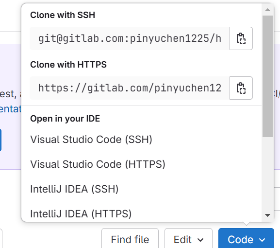

# 使用 ssh key 做身分驗證

* 產生 ssh key

```bash
 ssh-keygen -t rsa -C "yourEmail@example.com"
```

* 在家目錄中找到 `.ssh` 目錄，複製 `id_rsa.pub` 的內容：

```bash
cat ~/.ssh/id_rsa.pub
```

* 找到平台上的 ssh key 設定，將剛剛複製的內容貼上。

* 測試 ssh key 是否設定成功：

**GitHub**

```bash
ssh -T git@github.com
```
```text
Hi yourUsername! You've successfully authenticated, but GitHub does not provide shell access.
```

**GitLab**

```bash
ssh -T git@gitlab.com
```
```text
Welcome to GitLab, @yourUsername!
```

* 最後將 repo 的 url 設定為使用 ssh url：

```bash
# 新增遠端儲存庫
git remote add origin <ssh-url>
```

```bash
# 替換原有的 url
git remote set-url origin <ssh-url>
```

> ssh url 位置位置

**GitHub**


**GitLab**



